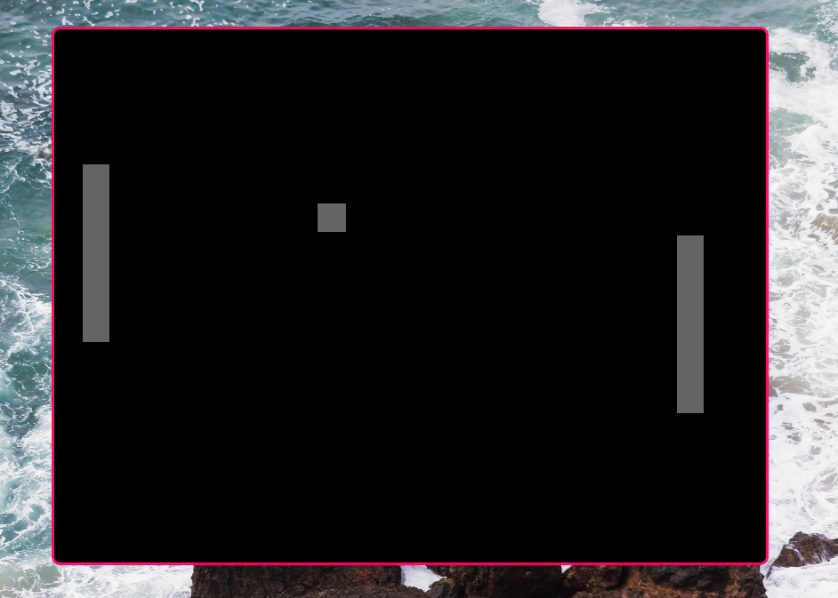

## Ping Pong

#### Dependicies
- ``make`` (optional)
- [sdl2](https://www.libsdl.org/)

```sh
git clone https://github.com/mustardfrog/ping-pong-cpp-sdl2
cd ping-pong-cpp-sdl2
```
<br />
```sh
# if you don't have make installed
chmod +x build.sh 
./build.sh && ./main
```

<br />
```sh
# using make
make && ./main
```


